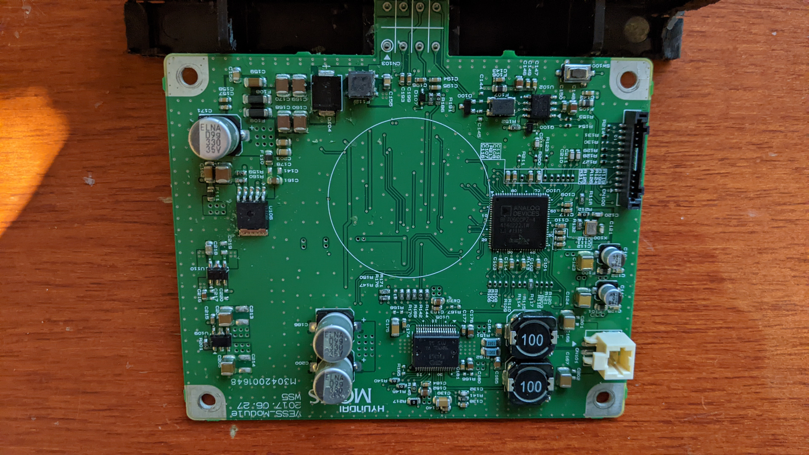
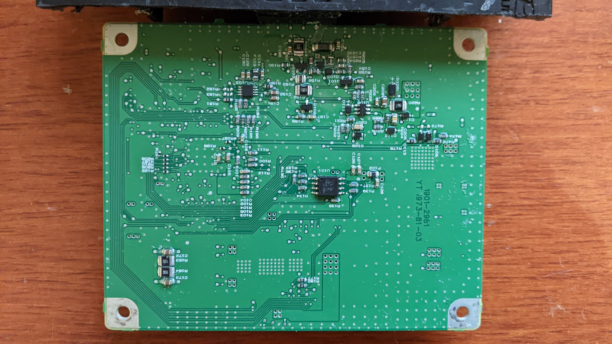

Mobis VESS
==========

Introduction
------------

The VESS is the Virtual Engine Sound System found in many KIA and Byundai
branded vehicles. A system like VESS has been required by law for electric
vehicles (EVs) since 2020 by EU law.

This research is not aimed at disabling VESS as you can do that very simply
by just unplugging it. The work here is some reverse engineering based on the
physical inspection only.

This work was done during the Christmas holiday of 2021.

A nice future roadmap might be to control the volume and change the sound:

 1. By flashing new SPI contents directly
 2. Using the onboard serial debug port
 3. Using ISO-TP over CAN
 4. Using the OBD II port

CAN
---

We know the device broadcasts using CID: 0x5E3 (1507d), with an 8 * 0x00 
broadcast data.

Many thanks to [Eric Reuter](https://www.youtube.com/watch?v=OLT1aKdpYhs) with
open source [code](https://github.com/ereuter/vess).

 - Does that make the request `5E3-8=5DB`?

Maybe using ISO-TP for multiple data packets?

 - Speed - `0x524` (1316d)
 - Gear - `0x200` (512d)

PCB
===

I cut the box but left the connector attached. I might want to connect this
to my car in the future and those friction-fit pins looked fragile.

Removing the conformal coating was really *fun*.

Notable components:

U101
----

`MX25L3235E`, 32Mbit flash chip.

U105
----

`FSA 803`, 1x45W class D amplifier.

U100
----

Analog `BF706CCPZ`, 400MHz 1Mb SRAM DSP.

U102
----

NXP A42/3C,`TJA1042` CAN transceiver.

CN100
-----

Similar to `SHR-12V-S-B`, used as debug port *presumably* for factory
programming.

 - 01, `VDD_EXT`
 - 02, `R317` -> `SYS_HWRST`
 - 03, `R117` -> `PB_09` -> `UART0_RX`
 - 04, `R116` -> `PB_08` -> `UART0_TX`
 - 05, `JTG_TDO_SWO`
 - 06, `JTG_TCK_SWCLK`
 - 07, `JTG_TDI`
 - 08, `JTG_TMS_SWDIO`
 - 09, `JTG_TRST`
 - 10, `GND`
 - 11, *Unknown*
 - 12, *Unknown*

SW100
-----

Connected to `SYS_HWRST` which triggers a CPU reset.

CN103
-----

This is supposed to be:

- 01, `Battery+`
- 02, `IG1`
- 03, `nc`
- 04, `P-CAN High`
- 05, `GND`
- 06, `GND`
- 07, `nc`
- 08, `P-CAN Low`

But in reality it's actually:

    4  3  2 [1]
    5  6  7  8

- 1 `Battery+`
- 2 ??
- 3 `CAN ??`
- 4 `CAN ??`
- 5 ??
- 6 ??
- 7 `GND`
- 8 `GND`

TTY
===

Connecting a 3.3v RS-232 adaptor to `UART0_RX` and `UART0_TX` gives a repeated:

    >---------------------------------------------------------<
    >                                                         <
    >     VESS Firmware 88.0201                               <
    >                                                         <
    >---------------------------------------------------------<

...and this loops forever, so I assumw the CPU is resetting on some kind of
watchdog...

Flash
=====

The full dump of the SPI device is [here](backup.bin).

ASCII strings are [here](strings.txt), some of which look super interesting.

    $ binwalk backup.bin
    DECIMAL       HEXADECIMAL     DESCRIPTION
    --------------------------------------------------------------------------------
    467552        0x72260         Microsoft executable, MS-DOS

